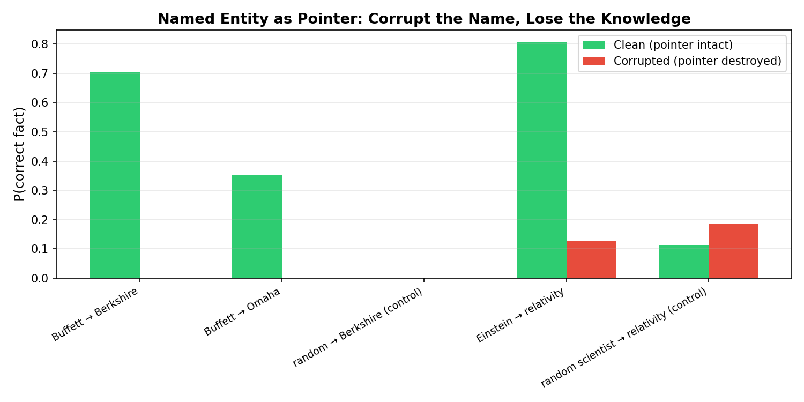
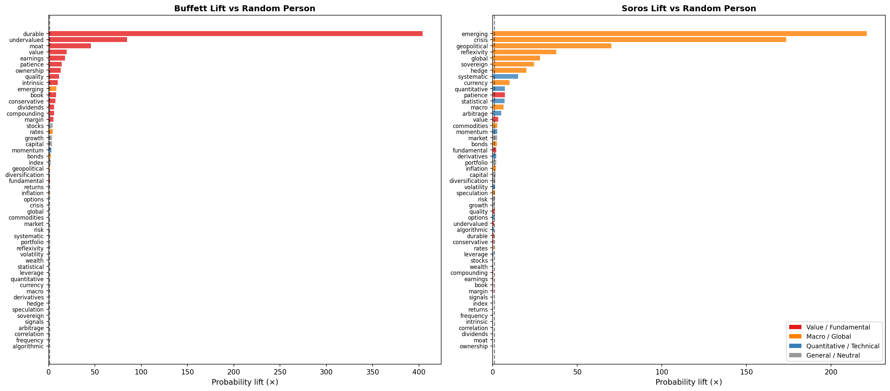

# Token as Pointer: Named Entities Activate Structured Knowledge Manifolds

**Model**: Gemma-2-2B (Google, 26 layers, 2304-dim)
**Date**: 2026-04-08

---

## Core Thesis

Named entity tokens function as **pointers** — not labels. "Warren Buffett" dereferences into a structured distribution over conceptual space (value investing, patience, moat) while suppressing others (algorithmic trading, derivatives). "A random person" dereferences to nothing — the distribution stays flat.

Two experiments verify this:

---

## Experiment 1: Causal Tracing — Corrupt the Pointer, Lose the Knowledge

### Method

Following [Meng et al. (NeurIPS 2022)](https://arxiv.org/abs/2202.05262): run the model on a factual prompt, corrupt the entity tokens with Gaussian noise, measure whether the model can still retrieve the associated fact. Then restore activations at individual (layer, position) sites to find where the knowledge lives.

### Results

| Prompt | Clean P(target) | Corrupted P(target) |
|---|---|---|
| "Warren Buffett is the CEO of ___" | **70.6%** (Berkshire) | **0.0%** |
| "Warren Buffett lives in ___" | **35.2%** (Omaha) | **0.0%** |
| "A random person is the CEO of ___" | 0.01% | 0.0% |
| "Albert Einstein is famous for the theory of ___" | **80.7%** (relativity) | 12.7% |
| "A random scientist is famous for the theory of ___" | 11.2% | 18.4% |

Destroy the name, destroy the knowledge. The control ("a random person") has no knowledge to lose — corrupting it changes nothing.

Restoration concentrates at subject token positions in early-to-mid layers (1–4), consistent with ROME's finding that mid-layer MLPs at the last subject token are the dereference site.



---

## Experiment 2: Concept Activation Manifold — A Pointer Dereferences to a Worldview

### Method

We gave the model five prompt templates per entity (e.g., "Warren Buffett believes the key to investing is ___") and measured the next-token probability assigned to 52 investment concepts spanning six philosophical dimensions. Averaged across templates to control for phrasing effects.

The six axes: **Value Analysis** (moat, intrinsic, undervalued...), **Long-term Compounding** (patience, dividends, durable...), **Macro & Geopolitics** (currency, crisis, reflexivity...), **Risk & Hedging** (derivatives, leverage, volatility...), **Quantitative Methods** (algorithmic, statistical, systematic...), **Growth & Markets** (stocks, portfolio, returns...).

### Results


Each entity activates a distinct manifold shape. Buffett spikes toward Value Analysis (42%) and Long-term Compounding (41%). Soros reaches uniquely into Macro & Geopolitics (22%). Simons pulls toward Quantitative Methods (17%). "A random person" collapses toward the most generic axis.

**Lift vs. baseline** ("a random person"):

| Entity | Most elevated concept | Lift | Most suppressed | Suppression |
|---|---|---|---|---|
| Buffett | `durable` | **404x** | `algorithmic` | 0.00x |
| Buffett | `moat` | 46x | `arbitrage` | 0.01x |
| Soros | `emerging` | 221x | `moat` | 0.05x |
| Soros | `crisis` | 174x | `intrinsic` | 0.07x |
| Simons | `statistical` | **1,471x** | `moat` | 0.07x |
| Simons | `algorithmic` | 90x | `currency` | 0.06x |

The pointer doesn't just activate — it shapes the entire probability landscape by elevating AND suppressing. Buffett and Simons are near-mirror images: what one elevates, the other suppresses.

### Limitation

This experiment measures **output logits only** — the model's final next-token prediction. It shows the pointer shapes what the model *says*, but not what happens in the internal representations. The structured manifold could emerge at any point in the network; logits tell us it exists at the output but not where or how it's constructed.



---

## What's Missing: Activation-Level Manifold

The two experiments above establish:
1. **Causal necessity** — the entity token is required to retrieve knowledge (Exp 1)
2. **Structured output** — the entity shapes a recognizable probability distribution (Exp 2)

What remains unshown: **does the structured manifold exist in the internal activations, not just the output?** If so, at which layer does it emerge? Can we read "value investor" vs. "macro trader" directly from the residual stream at the entity token position, before the model commits to a next-token prediction?

---

## Related Work

- [Meng et al., "Locating and Editing Factual Associations in GPT" (NeurIPS 2022)](https://arxiv.org/abs/2202.05262) — ROME methodology
- [Anthropic, "Scaling Monosemanticity" (2024)](https://transformer-circuits.pub/2024/scaling-monosemanticity/) — Entity features in sparse autoencoders
- [Anthropic, "On the Biology of a Large Language Model" (2025)](https://transformer-circuits.pub/2025/attribution-graphs/biology.html) — Attribution graphs, entity → knowledge circuits
- [Hernandez et al., "Linearity of Relation Decoding" (ICLR 2024)](https://arxiv.org/abs/2308.09124) — Entity-attribute mappings as linear transformations

## Reproducing

```bash
pip install torch transformers scikit-learn matplotlib numpy
python run.py                  # all experiments
python run.py --experiment 2   # causal tracing only
python run.py --experiment 3   # manifold only
```
